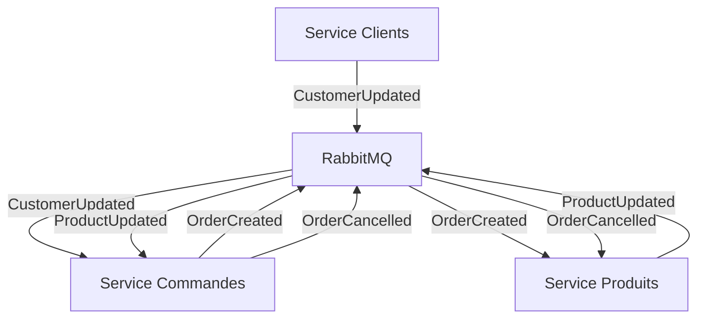

# 🏗️ ARCHITECTURE PayeTonKawa

## 🎯 **VISION GLOBALE**

PayeTonKawa migre d'une architecture monolithique (ERP + CRM + Site Web) vers une **architecture microservices** distribuée et scalable.

---

## 📐 **ARCHITECTURE MICROSERVICES**

### **🔗 Vue d'ensemble**
```
                          🌐 CLIENT APPLICATIONS
                                    |
                          ⚡ API GATEWAY (Port 3000)
                         /         |         \
                        /          |          \
             🧑‍💼 CLIENTS     📦 PRODUITS    🛒 COMMANDES
            (Port 3001)    (Port 3002)     (Port 3003)
                 |              |              |
            🗄️ clients-db  🗄️ produits-db  🗄️ commandes-db
            (Port 5433)    (Port 5434)     (Port 5435)
                        \       |       /
                         \      |      /
                     📨 RabbitMQ Message Broker
                        (Ports 5673/15672)
```

### **📊 Services et Responsabilités**

| Service | Port | Responsabilités | Base de données |
|---------|------|----------------|-----------------|
| **API Gateway** | 3000 | • Routage des requêtes<br>• Documentation Swagger centralisée<br>• Authentification JWT<br>• Rate limiting | - |
| **Clients** | 3001 | • Gestion des clients<br>• Profils et adresses<br>• Informations entreprises | PostgreSQL (5433) |
| **Produits** | 3002 | • Catalogue produits<br>• Gestion des stocks<br>• Recherche et filtres | PostgreSQL (5434) |
| **Commandes** | 3003 | • Gestion des commandes<br>• Validation métier<br>• Calculs et totaux | PostgreSQL (5435) |
| **RabbitMQ** | 5673 | • Message broker<br>• Synchronisation des données<br>• Événements métier | - |

---

## 🔄 **COMMUNICATION INTER-SERVICES**

### **📨 Événements métier (Message Broker)**



### **🔗 API REST (Communication directe)**
- **API Gateway** → Services : Routage HTTP
- **Service Commandes** → Service Clients : Validation client existant
- **Service Commandes** → Service Produits : Vérification stock

---

## 🗄️ **MODÈLE DE DONNÉES**

### **👤 Service Clients**
```typescript
Customer {
  id: string
  name: string
  username: string
  firstName: string
  lastName: string
  email: string
  createdAt: Date
  address: Address
  profile: Profile
  company: Company
}

Address {
  postalCode: string
  city: string
}

Profile {
  firstName: string
  lastName: string
}

Company {
  companyName: string
}
```

### **📦 Service Produits**
```typescript
Product {
  id: string
  name: string
  createdAt: Date
  details: ProductDetails
  stock: number
}

ProductDetails {
  price: number
  description: string
  color: string
}
```

### **🛒 Service Commandes**
```typescript
Order {
  id: string
  customerId: string
  createdAt: Date
  status: OrderStatus
  total: number
  items: OrderItem[]
}

OrderItem {
  id: string
  orderId: string
  productId: string
  quantity: number
  unitPrice: number
}

enum OrderStatus {
  PENDING = 'pending'
  CONFIRMED = 'confirmed'
  SHIPPED = 'shipped'
  DELIVERED = 'delivered'
  CANCELLED = 'cancelled'
}
```

---

## 🚢 **STRATÉGIE DE DÉPLOIEMENT**

### **🐳 Docker par Service**

**Structure des repositories :**
```
├── clients-back/          (Repository séparé)
│   ├── docker-compose.yml
│   ├── Dockerfile
│   └── src/
├── produits-back/         (Repository séparé)
│   ├── docker-compose.yml
│   ├── Dockerfile
│   └── src/
├── commandes-back/        (Repository séparé)
│   ├── docker-compose.yml
│   ├── Dockerfile
│   └── src/
├── api-gateway/           (Repository séparé)
│   ├── docker-compose.yml
│   ├── Dockerfile
│   └── src/
└── docker-compose.global.yml (Développement local)
```

### **🌐 Réseau Docker**
```yaml
networks:
  payetonkawa-network:
    driver: bridge
    external: true  # Réseau partagé entre tous les services
```

---

## 🔐 **SÉCURITÉ**

### **🔑 Authentification**
- **JWT Tokens** gérés par l'API Gateway
- **Middleware d'authentification** dans chaque service
- **Refresh tokens** pour les sessions longues

### **🛡️ Protection**
- **Rate limiting** par IP et par utilisateur
- **Validation stricte** des entrées (DTOs)
- **CORS** configuré par environnement
- **HTTPS** en production

---

## 📊 **MONITORING & OBSERVABILITÉ**

### **📈 Métriques collectées**
- **HTTP** : Codes retour, temps de réponse, nb requêtes
- **BDD** : Temps de requête, connexions actives
- **RabbitMQ** : Messages par queue, latence
- **Métier** : Nb commandes, revenus, stock bas

### **🔍 Logs structurés**
```json
{
  "timestamp": "2024-01-01T10:00:00Z",
  "level": "info",
  "service": "clients-back",
  "method": "GET",
  "endpoint": "/customers/123",
  "statusCode": 200,
  "responseTime": 45,
  "userId": "user123"
}
```

---

## 🚀 **SCALABILITÉ**

### **🔄 Montée en charge**
- **Horizontal scaling** : Plusieurs instances par service
- **Load balancing** via l'API Gateway
- **Auto-scaling** basé sur les métriques

### **📦 Conteneurisation**
- **Images optimisées** avec multi-stage builds
- **Health checks** pour chaque service
- **Graceful shutdown** pour les maintenances

---

## 🔗 **ENDPOINTS API**

### **🧑‍💼 Service Clients (`/api/customers`)**
```
GET    /api/customers           # Liste avec pagination
GET    /api/customers/:id       # Détail client
POST   /api/customers           # Création
PATCH  /api/customers/:id       # Modification
DELETE /api/customers/:id       # Suppression
```

### **📦 Service Produits (`/api/products`)**
```
GET    /api/products            # Liste avec pagination
GET    /api/products/:id        # Détail produit
POST   /api/products            # Création
PATCH  /api/products/:id        # Modification
DELETE /api/products/:id        # Suppression
GET    /api/products/search     # Recherche avancée
```

### **🛒 Service Commandes (`/api/orders`)**
```
GET    /api/orders              # Liste des commandes
GET    /api/orders/:id          # Détail commande
POST   /api/orders              # Création
PATCH  /api/orders/:id          # Modification
DELETE /api/orders/:id          # Annulation
GET    /api/customers/:id/orders # Commandes d'un client
```

---

## 🏗️ **CHOIX TECHNIQUES JUSTIFIÉS**

| Composant | Technologie | Justification |
|-----------|-------------|---------------|
| **Framework** | NestJS + TypeScript | • Structure modulaire<br>• Decorators pour validation<br>• Écosystème mature<br>• Type safety |
| **Base de données** | PostgreSQL | • ACID compliance<br>• Performance éprouvée<br>• Extensions riches<br>• JSON support |
| **Message Broker** | RabbitMQ | • Fiabilité entreprise<br>• Patterns avancés<br>• Management UI<br>• Retry/DLQ natif |
| **Documentation** | Swagger/OpenAPI | • Génération automatique<br>• Interface de test<br>• Standard industrie |
| **Monitoring** | Grafana + Prometheus | • Métriques temps réel<br>• Alerting configuré<br>• Dashboards riches |

---

## 📋 **PROCHAINES ÉTAPES**

1. ✅ **Architecture validée**
2. 🚧 **Phase 2.1** : Configuration Docker par service
3. 🚧 **Phase 2.2** : API Gateway avec Swagger centralisé
4. 🚧 **Phase 3** : Développement des microservices 